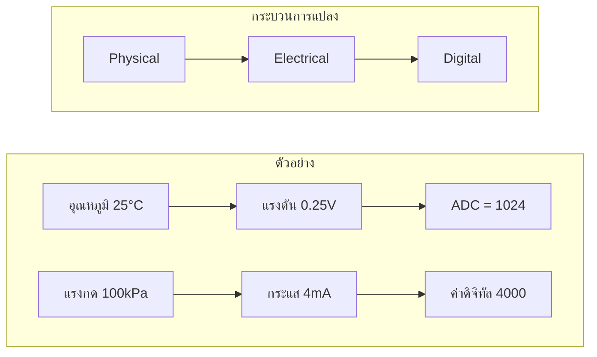

# **3.3 การเชื่อมสองโลก: จาก Physical → Electrical → Digital**

ระบบ IoT สามารถทำงานได้เพราะเรามีวิธีแปลงข้อมูลจากโลกจริงที่เป็น **Analog, มี Noise, ต่อเนื่อง** ให้กลายเป็นข้อมูลในโลกดิจิทัลที่ **Discrete, แม่นยำ, ตรวจสอบได้** ผ่านกระบวนการแปลงสัญญาณหลายขั้นตอน

ภาพรวมของกระบวนการคือ

 

# **ขั้นตอนการแปลงสัญญาณอย่างเป็นระบบ**

## **1. Physical → Electrical (Sensor / Transducer)**

โลกกายภาพมีปริมาณที่วัดได้ เช่น อุณหภูมิ แรงกด แสง ความเข้มข้นก๊าซ สนามแม่เหล็ก ฯลฯ แต่ MCU ไม่สามารถอ่านค่ากายภาพโดยตรงได้ จึงต้องใช้ **Sensor** หรือ **Transducer** เพื่อแปลงปริมาณเหล่านี้ให้เป็นสัญญาณไฟฟ้า

### ตัวอย่างการแปลงกายภาพ → ไฟฟ้า

- **Thermistor** อุณหภูมิ → ความต้านทาน (ความต้านทานลดลงเมื่ออุณหภูมิเพิ่มขึ้น)
- **Piezoelectric Sensor** แรงกด → แรงดันไฟฟ้า (ผลึกสร้างแรงดันเมื่อถูกบีบอัด)
- **Photodiode** แสง → กระแสไฟฟ้า (ยิ่งแสงมาก กระแสยิ่งสูง)
- **Hall Sensor** สนามแม่เหล็ก → แรงดันไฟฟ้า (แรงดันเปลี่ยนตามความแรงของสนามแม่เหล็ก)

เซนเซอร์คือ “ประตูแรก” ที่เชื่อมโลกจริงเข้ากับวงจรไฟฟ้า

## **2. Electrical Signal Conditioning (การปรับสภาพสัญญาณ)**

สัญญาณไฟฟ้าที่ออกจากเซนเซอร์มักจะ **อ่อน**, **มี Noise**, หรือ **ไม่อยู่ในช่วงที่ ADC อ่านได้** จึงต้องมีการปรับสภาพสัญญาณก่อนเข้าสู่ MCU

### กระบวนการปรับสภาพสัญญาณ

- **Amplification (การขยายสัญญาณ)** ขยายแรงดันหรือกระแสให้สูงพอสำหรับ ADC
- **Filtering (การกรองสัญญาณรบกวน)** เช่น Low-pass filter, Moving average ลด Noise จากโลกกายภาพ
- **Level Shifting (การปรับระดับแรงดัน)** เช่น แปลง 0–5V → 0–3.3V เพื่อให้เข้ากับ MCU
- **Linearization (การทำให้สัญญาณเป็นเส้นตรง)** เช่น แปลงสัญญาณจาก Thermistor ให้เป็นเส้นตรงตามอุณหภูมิ

ขั้นตอนนี้ทำให้สัญญาณไฟฟ้าพร้อมสำหรับการแปลงเป็นดิจิทัล

## **3. Electrical → Digital (Analog-to-Digital Converter: ADC)**

ADC คืออุปกรณ์ที่แปลงแรงดันไฟฟ้าให้เป็นตัวเลขดิจิทัล
## การแปลง ADC 1 บิต

## การแปลง ADC 2 บิต

ถ้าเป็น ADC ขนาด 8, 10, 12, 16 บิต ขึ้นไป จะมีความละเอียดสูง เหมาะที่จะนำไปใช้กับสัญญาณที่มีรายละเอียดสูงๆ เช่น สัญญาณเสียง คลื่นหัวใจ สัญญาณภาพ 

#### คำถาม
ให้นักศึกษาคำนวณและสร้างจุดในกราฟ กรณี ADC ขนาด 3 บิต

## **4. Digital Processing & Communication**

เมื่อข้อมูลอยู่ในรูปดิจิทัลแล้ว MCU สามารถ

### **ประมวลผล (Processing)**
- คำนวณค่าเฉลี่ย
- ตรวจจับความผิดปกติ
- ทำ PID control
- วิเคราะห์แนวโน้ม (Trend analysis)

### **จัดเก็บ (Storage)**

- Flash
- EEPROM
- SD Card
- Database

### **สื่อสาร (Communication)**

- UART
- I2C
- SPI
- CAN
- Wi-Fi
- BLE
- LoRaWAN
- MQTT ไปยัง Cloud
### **แสดงผล (Visualization)**

- Dashboard
- Graph
- Digital Twin

 

# **สรุปภาพรวม**

| ขั้นตอน | โลก           | สิ่งที่เกิดขึ้น            | ตัวอย่าง                    |
| ------- | ------------- | -------------------------- | --------------------------- |
| 1       | Physical      | ปริมาณกายภาพ → สัญญาณไฟฟ้า | อุณหภูมิ → ความต้านทาน      |
| 2       | Electrical    | ปรับสภาพสัญญาณ             | ขยาย, กรอง, ปรับระดับแรงดัน |
| 3       | Digital       | ADC แปลงเป็นตัวเลข         | 0.25V → 310                 |
| 4       | Processing    | MCU ประมวลผล               | ควบคุมมอเตอร์, ส่งข้อมูล    |
| 5       | Communication | ส่งข้อมูลออกไป             | Wi-Fi, MQTT, Cloud          |

 